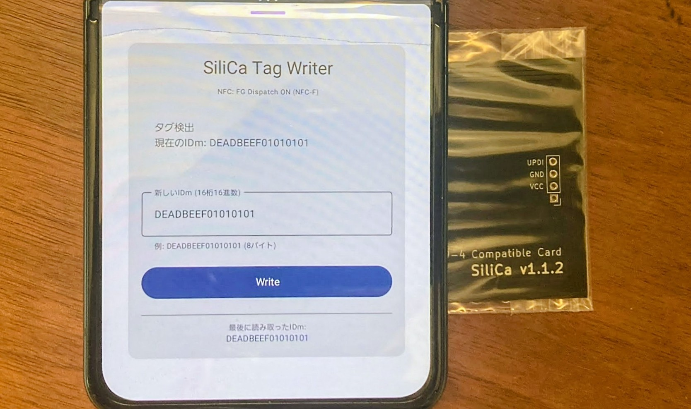

# SiliCaRW

SiliCa Tag Writer - SiliCa互換NFCタグのIDm値を読み書きするAndroidアプリケーション



## 概要

SiliCaRWは、SiliCa互換のNFCタグのIDm（識別番号）を読み書きできるAndroidアプリケーションです。NFC-F技術を使用して互換カードと通信し、タグ識別子を簡単に変更できるインターフェースを提供します。

## 機能

- **IDm読み取り**: NFC-Fタグを検出すると自動的に現在のIDm値を読み取ります
- **IDm書き込み**: カスタムの8バイト（16桁の16進数）IDm値を互換タグに書き込めます
- **リアルタイムステータス**: 接続状態と操作結果をリアルタイムで表示します
- **検証機能**: 書き込み操作後、自動的にIDm値を検証します
- **Material Design 3**: Jetpack ComposeとMaterial Design 3で構築されたモダンなUI

## 動作要件

- NFC機能を搭載したAndroidデバイス
- Android 11（APIレベル30）以上
- NFC-F互換タグ（SiliCa）

## インストール

1. このリポジトリをクローン:
   ```bash
   git clone https://github.com/muojp/SiliCaRW.git
   cd SiliCaRW
   ```

2. Android Studioでプロジェクトを開く

3. NFC対応のAndroidデバイスでアプリケーションをビルド・実行

## 使い方

1. アプリケーションを起動
2. AndroidデバイスのNFCを有効にする（まだの場合）
3. IDmを読み取る場合:
   - NFC-Fタグをデバイスに近づける
   - 現在のIDmが表示されます
4. 新しいIDmを書き込む場合:
   - 16桁の16進数値を入力（例: `DEADBEEF01010101`）
   - 「Write」ボタンをタップ
   - プロンプトが表示されたらタグをデバイスに近づける
   - アプリケーションが自動的に書き込みを検証します

## 技術詳細

- **パッケージ**: `jp.muo.silicarw`
- **言語**: Kotlin
- **UIフレームワーク**: Jetpack Compose
- **NFC技術**: NFC-F
- **ターゲットSDK**: Android 14（APIレベル36）
- **最小SDK**: Android 11（APIレベル30）

### NFC通信

アプリケーションはAndroid NFC APIを使用してSiliCaタグと通信します:
- タグIDからIDm値を読み取り
- SiliCa書き込みコマンドを使用してブロック0x83に書き込み
- 適切な接続処理と検証を実装

## ライセンス

このプロジェクトはApache License 2.0の下でライセンスされています。詳細は[LICENSE](LICENSE)ファイルを参照してください。

## 免責事項

このアプリケーションは教育目的および許可された使用のみを意図しています。NFCタグを変更する権限があることを常に確認してください。
